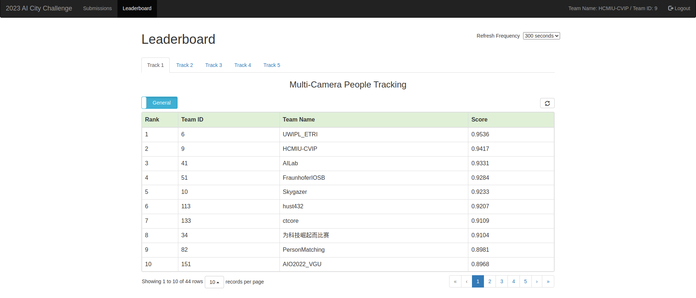
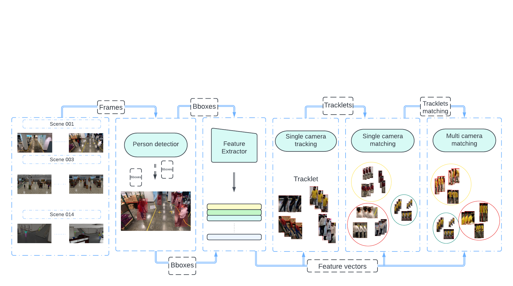

# AIC README
# [[CVPRW] 2023 AI City Challenge:](https://www.aicitychallenge.org/) Multi-camera People Tracking With Mixture of Realistic and Synthetic Knowledge

The 2nd Place Submission to The 7th NVIDIA AI City Challenge (2023) Track 1: Multi-camera people tracking

 \[[paper](https://openaccess.thecvf.com/content/CVPR2023W/AICity/papers/Nguyen_Multi-Camera_People_Tracking_With_Mixture_of_Realistic_and_Synthetic_Knowledge_CVPRW_2023_paper.pdf)\]



# Framework



## Setup

### Install environment

```
conda install pytorch==1.10.1 torchvision==0.11.2 torchaudio==0.10.1 cudatoolkit=11.3 -c pytorch -c conda-forge

pip install -r requirements.txt

pip install -e .

```

### Setup environment path:

To begin, rename the file [.env.list](https://www.notion.so/hcmiucvip/.env.list) to .env.

Then, in the [.env](https://www.notion.so/hcmiucvip/.env), update the following variables:

- *DATASETS.ROOT_DIR*: the path to the dataset directory
- *PRETRAIN_ROOT*: the path to the pretrain directory

Example:

```
DATASETS.ROOT_DIR='/mnt/ssd8tb/quang/AIC23_Track1_MTMC_Tracking/'
PRETRAIN_ROOT='/mnt/ssd8tb/quang/pretrain'
```

Go to `scripts/tracking.sh` and change the `DATASET_DIR` path on line 2 to the correct path for your dataset.

### Extract frames

```jsx
python tools/extract_frame.py
```

### Directory structure:
#### Code structure
```
Multi-camera-People-Tracking-With-Mixture-of-Realistic/
├── assets/
├── configs/
├── datasets/
│   ├── detection/
│   │   └── Yolo/
│   ├── reid/
│   ├── pretrain/
│       ├── HRNet_W48_C_ssld_pretrained.pth
│       ├── -------
│       └── jx_vit_base_p16_224-80ecf9dd.pth
│   └── ROI/
├── output/
│   └── weight/
│       ├── HrNetW48/
│           └── HrNet_epoch_3.ckpt
│       ├── transformer/
│           └── transformer_epoch_4.ckpt
│       └── trans_local/
│           └── trans_local_epoch_3.ckpt
├── outputs/
├── -------
├── scripts/
├── src/
├── -------
└── tools/
```
#### Data structure:
Please download the reid train from the link above. Then put it under the path: `AIC23_Track1_MTMC_Tracking/`
```
AIC23_Track1_MTMC_Tracking/
├── test/
├── train/
├── validation/
├── person_reid/
│   ├── gallery/
│   ├── query/
│   └── train/
└──
```
## Inference

For fast inference, please visit this [link](https://drive.google.com/drive/folders/1S9FZPPGOP3LHTwsjP1mvB0xNCWybicvF) and download all trained models and datasets.

To save time on detection, please use the pre-detected dataset.

### Tracking

Extract feature for tracking 

```jsx
bash scripts/feature_extract_tracking.sh
```

Tracking:

```jsx
bash scripts/tracking.sh
```

### Single-camera matching and multi-camera matching

Extract feature for matching:

```jsx
bash scripts/feature_extract_matching.sh
```

Note that only scene 001 requires extracting features again. For another scene, features generated from tracking are available in the folder `src/SCMT/tmp`.

Matching:

```jsx
bash scripts/matching.sh
```

### Final submit

```jsx
python src/submit.py
```

The result at `outputs/track1.txt`

### For test ID switch
```jsx
python src/matching/tracklet_id_switch.py
```

## Training

### Detection:

Please follow the detection in the Detection folder.

### Reid:

```jsx
bash scripts/reid_train.sh
```

After training, the weight will be stored in the `lightning_logs/` folder. Navigate to this folder and copy the corresponding epoch weight of each model to the corresponding folder in `output/weight`.

The following epoch should be used for each model:

- Transformer: Epoch 4
- Transformer-Local: Epoch 3
- HrNetW48: Epoch 3


# Contact

If you have any questions, please leave an issue or contact us at [nguyenquivinhquang@gmail.com](mailto:nguyenquivinhquang@gmail.com).

# Acknowledgement

We would like to thank the [Box-Grained Reranking Matching for Multi-Camera Multi-Target Tracking](https://github.com/Yejin0111/AICITY2022-Track1-MTMC) repository for their outstanding tracking.
